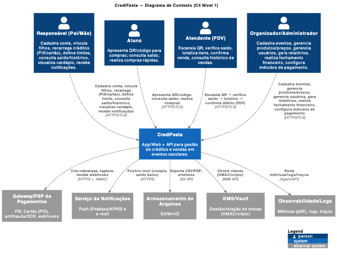
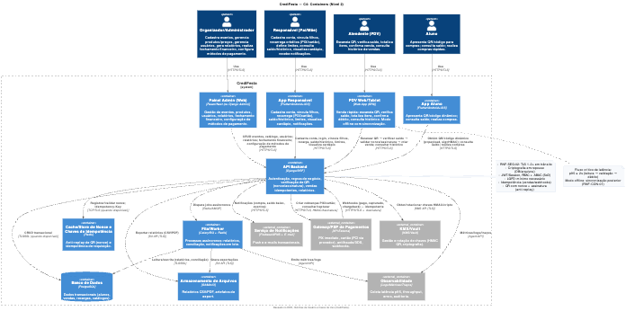
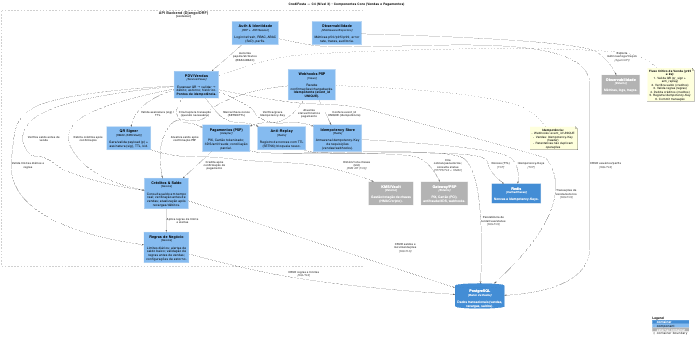
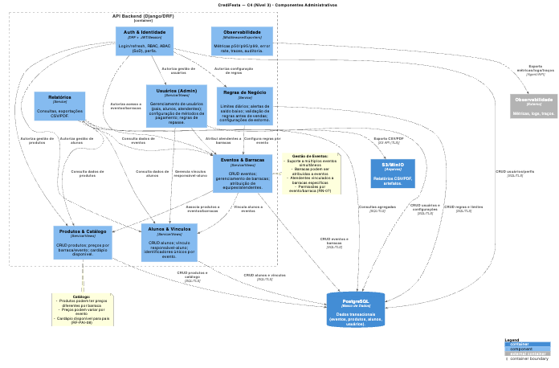
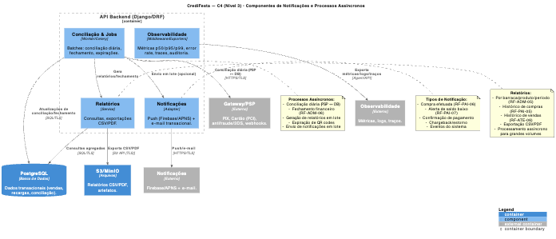

# CrediFesta

## Visão rápida

CrediFesta é um projeto para gestão de créditos em eventos escolares. Permite que responsáveis recarreguem saldo (PIX/cartão), que alunos apresentem um código/QR para compra rápida e que atendentes realizem vendas no PDV de forma idempotente e auditável. O projeto contém documentação de requisitos, diagramas de arquitetura (C4/PlantUML) e esboços de API.

---

## O que há neste repositório

### Documentação de Requisitos
- [`requisitos/gerais/DER_CrediFesta.md`](requisitos/gerais/DER_CrediFesta.md) — Documento de Especificação de Requisitos (visão funcional, RN, atores, critérios de aceite e protótipos de API).
- [`requisitos/historia_do_usuario/historias_do_usuario.md`](requisitos/historia_do_usuario/historias_do_usuario.md) — 22 histórias do usuário organizadas por perfil.

### Diagramas de Arquitetura (C4 Model)

#### Diagrama de Contexto (Nível 1)
[](diagramas/diagrama-de-contexto/CrediFesta-contexto.puml)

**Arquivo:** [`diagramas/diagrama-de-contexto/CrediFesta-contexto.puml`](diagramas/diagrama-de-contexto/CrediFesta-contexto.puml)

---

#### Diagrama de Container (Nível 2)
[](diagramas/diagrama-de-container/CrediFesta-container.puml)

**Arquivo:** [`diagramas/diagrama-de-container/CrediFesta-container.puml`](diagramas/diagrama-de-container/CrediFesta-container.puml)

---

#### Diagramas de Componentes (Nível 3)

**Componentes Core (Vendas e Pagamentos):**
[](diagramas/diagrama-de-componentes/CrediFesta-componentes-core.puml)

**Arquivo:** [`diagramas/diagrama-de-componentes/CrediFesta-componentes-core.puml`](diagramas/diagrama-de-componentes/CrediFesta-componentes-core.puml)

---

**Componentes Administrativos:**
[](diagramas/diagrama-de-componentes/CrediFesta-componentes-admin.puml)

**Arquivo:** [`diagramas/diagrama-de-componentes/CrediFesta-componentes-admin.puml`](diagramas/diagrama-de-componentes/CrediFesta-componentes-admin.puml)

---

**Componentes de Notificações e Processos Assíncronos:**
[](diagramas/diagrama-de-componentes/CrediFesta-componentes-notificacoes.puml)

**Arquivo:** [`diagramas/diagrama-de-componentes/CrediFesta-componentes-notificacoes.puml`](diagramas/diagrama-de-componentes/CrediFesta-componentes-notificacoes.puml)

---

## Arquitetura (resumo)

Baseado no DER e nos diagramas, as decisões arquiteturais principais são:

- **Frontends**: apps móveis (Responsável / Aluno), PDV web/tablet e painel admin (web).
- **Backend**: API REST (esboço indicado como Django + DRF nos diagramas) com autenticação JWT, regras de negócio (vendas, limites, estornos), geração/validação de QR com assinatura HMAC e controle anti-replay (nonce).
- **Persistência**: PostgreSQL para dados transacionais; Redis para nonces e idempotency keys.
- **Workers**: filas (Celery/RQ) para conciliação, geração de relatórios e envio de notificações.
- **Integrações externas**: PSP (PIX/cartão) via webhooks, serviço de push/e-mail, S3/MinIO para arquivos e KMS/Vault para chaves HMAC.

Esses detalhes estão modelados nos diagramas dentro de `diagramas/` e no `DER_CrediFesta.md`.

---

## Documentação disponível

- **Requisitos e regras de negócio**: [`requisitos/gerais/DER_CrediFesta.md`](requisitos/gerais/DER_CrediFesta.md) (pontos importantes, critérios de aceite e protótipos de API).
- **Histórias do usuário**: [`requisitos/historia_do_usuario/historias_do_usuario.md`](requisitos/historia_do_usuario/historias_do_usuario.md) (22 histórias organizadas por perfil).
- **Diagramas C4 (PlantUML)**: dentro de `diagramas/` — contexto, containers e componentes.
- **Protótipos de API (esboço)**: seção "Protótipos de API (esboço REST)" em [`requisitos/gerais/DER_CrediFesta.md`](requisitos/gerais/DER_CrediFesta.md).

---

## Como visualizar os diagramas PlantUML

Recomenda-se usar VS Code com a extensão PlantUML (ou outra ferramenta de visualização PlantUML). Opções rápidas:

### 1. VS Code (recomendado)

- Instale a extensão "PlantUML" (jwbennett/PlantUML ou PlantUML by jebbs) e abra os arquivos `.puml` em `diagramas/`.
- Use `Alt+D` (ou `Cmd+Shift+P` → "PlantUML: Preview") para visualizar.

### 2. CLI (macOS) — via Homebrew

```bash
# Instalar (se necessário)
brew install plantuml

# Renderizar um diagrama (gera PNG/SVG no mesmo diretório)
plantuml diagramas/diagrama-de-contexto/CrediFesta-contexto.puml
```

### 3. Online

- Use [PlantUML Web Server](http://www.plantuml.com/plantuml/uml/) e cole o conteúdo do arquivo `.puml`.

**Nota:** o PlantUML necessita de Java; se usar o `plantuml.jar` ou um container Docker, ajuste conforme seu ambiente.

---


## Contribuição

Abra issues para discutir mudanças de requisitos, diagramas ou especificações. Se for contribuir com código, adicione PRs pequenos com testes e atualização do README de submódulos.
